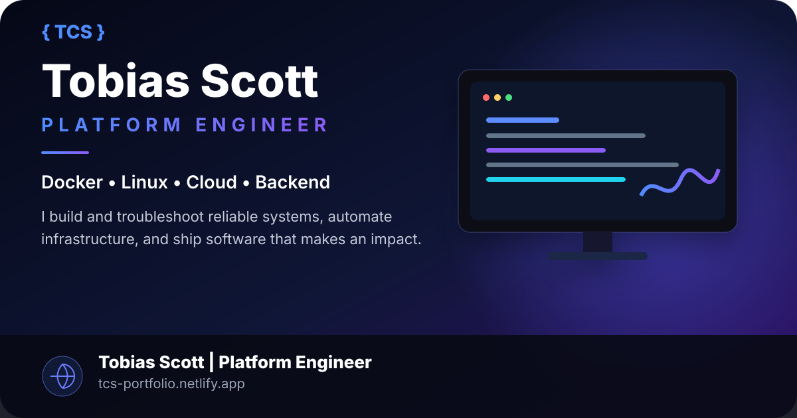

# Tobias Scott — Engineering Portfolio

<p align="center">
  
</p>

<p align="center">
  <strong>Platform & Software Engineer</strong><br />
  Docker • Linux • Cloud • Backend APIs • Kubernetes • CI/CD • Reliability
</p>

<p align="center">
  <a href="https://tcs-portfolio.netlify.app/"><strong>View Live Portfolio</strong></a>
  ·
  <a href="https://github.com/mergemaven11">GitHub</a>
  ·
  <a href="https://www.linkedin.com/in/tobias-scott-he-him-b3572751/">LinkedIn</a>
</p>

## About

This repository contains my engineering portfolio, focused on the systems I build, support, troubleshoot, and operate across platform engineering, production support, backend development, cloud infrastructure, automation, and full-stack product development.

My work spans Docker and Linux troubleshooting, containerized environments, cloud-connected systems, backend APIs, CI/CD, observability-minded debugging, and product engineering with Python and JavaScript ecosystems.

## Core Areas

- **Platform Engineering:** Docker, Linux, containers, networking, registries, Compose, Kubernetes, Helm
- **Backend Engineering:** Python, FastAPI, REST APIs, MongoDB, PostgreSQL, SQLAlchemy
- **Cloud & Delivery:** AWS, CI/CD, GitHub Actions, Netlify, containerized development workflows
- **Reliability:** production troubleshooting, logs, metrics, reproducible test cases, root-cause analysis
- **Full-Stack Development:** React, JavaScript, TypeScript, authentication, testing, privacy controls
- **Automation:** internal tooling, engineering workflows, AI-governance tooling, developer productivity

## Featured Projects

### BragStack

Career-focused SaaS for capturing evidence-backed accomplishments, measurable impact, skills, and review-ready career material.

**Stack:** FastAPI • React/Vite • MongoDB • Docker • GitHub Actions

- [Live Site](https://usebragstack.com)
- [API Docs](https://api.usebragstack.com/docs)
- [Source](https://github.com/mergemaven11/bragstack)

### Clinly

Secure professional-participant portal with encrypted messaging, journaling, progress tracking, tenant isolation, audit events, and authorization boundaries.

**Stack:** React • FastAPI • MongoDB • PyNaCl • Docker

- [Live Demo](https://clinly-demo.netlify.app/)
- [Source](https://github.com/mergemaven11/clinly-backbone)

### FlashQuest

Game-like spaced-repetition learning platform with accounts, email verification, private decks, XP, mastery progression, database migrations, readiness checks, and CI quality gates.

**Stack:** React • FastAPI • PostgreSQL • Alembic • Docker

- [Live Demo](https://flashquestt.netlify.app/)
- [Source](https://github.com/mergemaven11/FlashQuest)

### Variant Vault

Collector-focused inventory platform for organizing, documenting, valuing, and protecting physical collections with category-aware inventory, CSV import, barcode/OCR-assisted capture, analytics, backups, and ownership documentation.

**Stack:** Python • Streamlit • PostgreSQL • SQLAlchemy • Alembic • Docker • Kubernetes • GitHub Actions

- [Source](https://github.com/mergemaven11/variant-vault)

## Portfolio Stack

- React
- JavaScript
- HTML/CSS
- Netlify
- Docker
- GitHub
- Google Analytics
- Schema.org structured data

## Run Locally

```bash
git clone https://github.com/mergemaven11/Portfolio.git
cd Portfolio
yarn install
yarn start
```

The development server runs locally and reloads as changes are made.

## Production Build

```bash
yarn build
```

The optimized production output is written to the `build` directory.

## SEO & Discoverability

The site includes:

- descriptive page titles and metadata
- canonical URL configuration
- Open Graph and social preview metadata
- Schema.org `Person` structured data
- `robots.txt`
- XML sitemap
- semantic project sections and crawlable project links

## Contact

- **Portfolio:** https://tcs-portfolio.netlify.app/
- **GitHub:** https://github.com/mergemaven11
- **LinkedIn:** https://www.linkedin.com/in/tobias-scott-he-him-b3572751/
- **Email:** tobiascodes12@gmail.com

---

Built and maintained by **Tobias Scott**.
